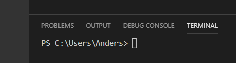

# Part 1, Code Versioning 
### **this is !important**

The first step to creating a website, is to setup up version control, I like to use the technology git, but there are others, which we won't get into. To setup git on Windows the easiest way is to 

* **1** download ***git*** from here https://git-scm.com/download/win. There are other ways, which I can explain if needed. 
* **2** Once git is installed hop over to https://github.com/ and create an account.
* **3**  Next login, if you haven't already and go to the top right of the screen click the plus sign and choose new repository

* **4** Fill out the repository name whatever you like, try using something descriptive like *website learning 1*. Give it a descriptive description next, choose public, then click create repository.
* **5** Now here comes the fun part open up you ide or code editor, either one of them can have a terminal, or command prompt built in (which is where you use ***git*** ), if it doesnt you can use terminal on mac and linux or powershell (for now) on windows. I am going to assume you are using the built in one in Visual Studio Code which you can download here https://code.visualstudio.com/ which runs on mac, windows and linux
* **6** Once you editor is running open the terminal, to do that in vscode you can use <kbd>Ctrl</kbd> + ~ or click on Terminal in top nav and choose New Terminal. Next type in your terminal that just opened `cd ~` this will take you to you windows User root location, mine is `C:\Users\Anders` Should look like this below, replacing your name with mine

* **7** Ok once you see what I see, type `mkdir *project-name*` use the for your repository name in step 4 in github.