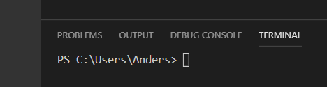
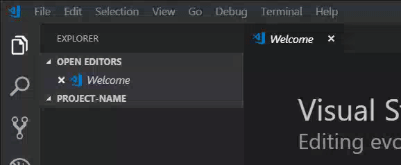
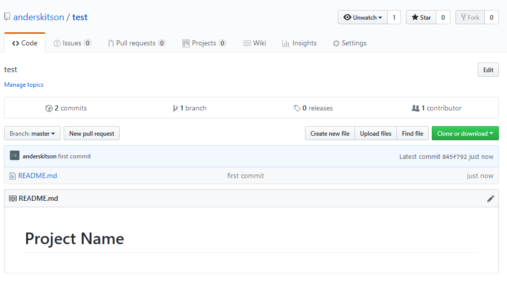

# Part 1, Code Versioning (Windows Instructions)
### **this is !important**

The first step to creating a website, is to setup up version control, I like to use the technology git, but there are others, which we won't get into. To setup git on Windows the easiest way is to 

* **1** download ***git*** from here https://git-scm.com/download/win. There are other ways, which I can explain if needed. 
* **2** Once git is installed hop over to https://github.com/ and create an account.
* **3**  Next login, if you haven't already and go to the top right of the screen click the plus sign and choose new repository

* **4** Fill out the repository name whatever you like, try using something descriptive like *website learning 1*. Give it a descriptive description next, choose public, then click create repository. (github will give you instructions, but I will write them below none the less, but everytime you create a repo github will give you this info so you dont have to come back to this document)
* **5** Now here comes the fun part open up you ide or code editor, either one of them can have a terminal, or command prompt built in (which is where you use ***git*** ), if it doesnt you can use terminal on mac and linux or powershell (for now) on windows. I am going to assume you are using the built in one in Visual Studio Code which you can download here https://code.visualstudio.com/ which runs on mac, windows and linux
* **6** Once you editor is running open the terminal, to do that in vscode you can use <kbd>Ctrl + ~</kbd> or click on Terminal in top nav and choose New Terminal. Next type in your terminal that just opened `cd ~` this will take you to you windows User root location, mine is `C:\Users\Anders` Should look like this below, replacing your name with mine. Next type `mkdir websites` hit return then type `cd websites` this will create a folder for you to store all your websites and then navigate you into that directory.

* **7** Ok once you are in the websites directory in terminal, type `mkdir project-name` use the name you used for your repository name in step 4 in github. Next type `cd project-name`. Great, getting exciting :grin:.
* **8** Click Open Folder in the Welcome Screen if you dont see a welcome screen go to File open folder, find your websites directory and open your project. This will reload vscode and you will now see the `project-name` your created with the `mkdir` command in the file explorer on the left.
* **9** Now here comes the first git command, open up Terminal type `git init` and always hit enter after i say type this in Terminal. Yay:raised_hands: you have now created your first git repository locally. 

*  **11** 
Next hover over your `project name` folder in the top left and click the +new file icon not new folder and name it README.md (as seen below) This is where all your documentation will go. The file should have opened :sparkles:automagically:sparkles:, now Write `# Project-Name` in the editor itself. Type <kbd>Ctrl + s</kbd>  or File save.

* **12** If you feel like this :dizzy_face: so far, welcome to website buidling, if not congrats :yum:
* **13** In Terminal type `git add README.md` This will stage your readme file to git and prepare it to be pushed up to github. Next type `git commit -m "first commit"` This will add a message associated with that file, that you can read in github, so it's basically notes about your coding progress as you go. Next open up that github repository we started in your browser. In that page there is instructions with a a command like this `git remote add origin ...` copy and paste that into terminal and hit enter. This connects your local ***git*** repo to your github one. Lastly type `git push -u origin master` this will push your code to github. Open the github repository again in the browser, and hit refresh. You should now see your README.md file with the name of your project. Wahooooo :metal: Should look like :point_down:

