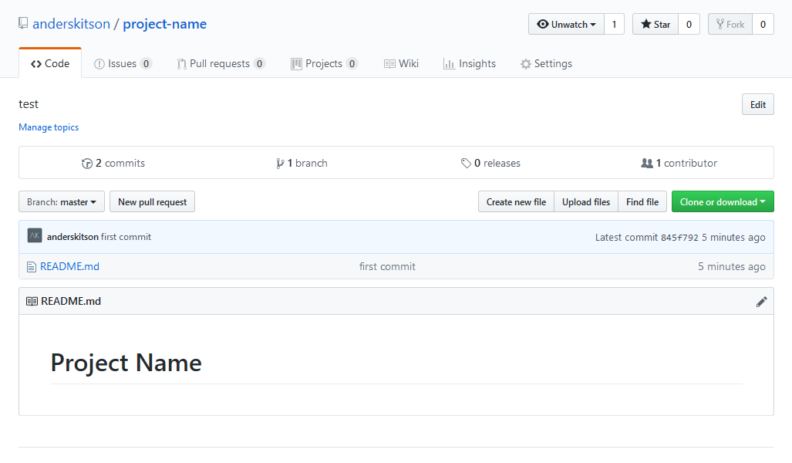

# Part 1, Code Versioning & Basic HTML/CSS/JS (Windows Instructions)
### **this is !important**

The first step to creating a website, is to setup up version control, I like to use the technology git, but there are others, which we won't get into. To setup git on Windows the easiest way is to 

* **1** download ***git*** from here https://git-scm.com/download/win. There are other ways, which I can explain if needed. 
  
* **2** Once git is installed hop over to https://github.com/ and create an account.
  
* **3**  Next login, if you haven't already and go to the top right of the screen click the plus sign and choose new repository


* **4** Fill out the repository name whatever you like, try using something descriptive like *website learning 1*. Give it a descriptive description next, choose public, then click create repository. (github will give you instructions, but I will write them below none the less, but everytime you create a repo github will give you this info so you dont have to come back to this document)
  
* **5** Now here comes the fun part open up you ide or code editor, either one of them can have a terminal, or command prompt built in (which is where you use ***git*** ), if it doesnt you can use terminal on mac and linux or powershell (for now) on windows. I am going to assume you are using the built in one in Visual Studio Code which you can download here https://code.visualstudio.com/ which runs on mac, windows and linux
  
* **6** Once you editor is running open the terminal, to do that in vscode you can use <kbd>Ctrl + ~</kbd> or click on Terminal in top nav and choose New Terminal. Next type in your terminal that just opened `cd ~` this will take you to you windows User root location, mine is `C:\Users\Anders` Should look like this below, replacing your name with mine. Next type `mkdir websites` hit return then type `cd websites` this will create a folder for you to store all your websites and then navigate you into that directory.


* **7** Ok once you are in the websites directory in terminal, type `mkdir project-name` use the name you used for your repository name in step 4 in github. Next type `cd project-name`. Great, getting exciting :grin:.
  
* **8** Click Open Folder in the Welcome Screen if you dont see a welcome screen go to File open folder, find your websites directory and open your project. This will reload vscode and you will now see the `project-name` your created with the `mkdir` command in the file explorer on the left.
  
* **9** Now here comes the first git command, open up Terminal type `git init` and always hit enter after i say type this in Terminal. Yay:raised_hands: you have now created your first git repository locally. 

*  **11** 
Next hover over your `project name` folder in the top left and click the +new file icon not new folder and name it README.md (as seen below) This is where all your documentation will go. The file should have opened :sparkles:automagically:sparkles:, now Write `# Project-Name` in the editor itself. Type <kbd>Ctrl + s</kbd>  or File save.


* **12** If you feel like this :dizzy_face: so far, welcome to website buidling, if not congrats :yum:
  
* **13** In Terminal type `git add README.md` This will stage your readme file to git and prepare it to be pushed up to github. Next type `git commit -m "first commit"` This will add a message associated with that file, that you can read in github, so it's basically notes about your coding progress as you go. Next open up that github repository we started in your browser. In that page there is instructions with a a command like this `git remote add origin ...` copy and paste that into terminal and hit enter. This connects your local ***git*** repo to your github one. Lastly type `git push -u origin master` this will push your code to github. Open the github repository again in the browser, and hit refresh. You should now see your README.md file with the name of your project. Wahooooo :metal: Should look like :point_down:



* **14** create `index.html` in vscode, copy and paste the text below and save.

```
<!doctype html>
<html lang="en">
    <head>
        <meta charset="utf-8">
        <title>project-name</title>
        <meta name="viewport" content="width=device-width, initial-scale=1">
        <link rel="stylesheet" href="css/style.css">
    </head>
    <body>
        <p>Hello world! This is HTML5 Boilerplate.</p>
    </body>
</html>
```
* **15** Next we are going to add this file to git and push it up run `git add .` return, then `git commit -m "added index"` then `git push`
  
* **16** Go to your github repo and you can now see your index.html file
  
* **17** Next up we are going to install something called node with a Node Version Manager, *nvm* short, this will allow us to use seperate node modules which allow us to upload code to a server, or compile css or run a local server, to do so go and download `nvm-setup.zip` from https://github.com/coreybutler/nvm-windows/releases extract and run the installer

* **18** Once installed looke at the Usage https://github.com/coreybutler/nvm-windows#usage now open a new taba and go to https://nodejs.org/en/ Note the current number, currently mine says 11.3.0
  
* **19** Now go to your terminal and type `nvm install 11.3.0` Great you have now installed node, just to make sure you are using node run `nvm use 11.3.0` next type in terminal `node -v` to make sure you are running the node version you just installed.
  
* **20** Now go to https://surge.sh/ we are going to use this to publish our webiste for free. Boom :boom: Now open terminal and run `npm install --global surge`. This will give us a tool where we can host our project easily for free, and we can even use a custom domain.
  
* **21** Now run the magic command `surge` enter. Give your project a name and hit enter. Now visit your surge website.
  
* **22** Next we are going to setup sass/css `npm install gulp-cli -g` gulp is a tool for compiling and sass files into css so we can style our website.
  
* **23** Create a package.json file `npm init` this is where our project with track our node modules versions, plus some other info we don't need to worry about right now.
  
* **24** install the gulp and browser sync node modules package in you devDependencies `npm install --save-dev gulp@next` now run browsersync install `npm install browser-sync --save-dev`
- Create a `Gulpfile.js`
- In your `Gulpfile.js` add the following code below

```
var gulp = require("gulp");
var sass = require("gulp-sass");
var browserSync = require("browser-sync").create();

gulp.task("styles", function() {
  gulp
    .src("sass/**/*.scss")
    .pipe(sass().on("error", sass.logError))
    .pipe(gulp.dest("./css/"));
});

// Static server
gulp.task("browser-sync", function() {
  browserSync.init({
    server: {
      baseDir: "./"
    }
  });
});

//Watch task
gulp.task("default", function() {
  gulp.watch("sass/**/*.scss", gulp.series("styles"));
});

```

* **25** Create a file in this directory `sass/style.scss` Next create a `css folder` in the root directory. Go into your `style.scss` file and add this code below.

```
body{
    background:aqua;
}
```
* **26** Now in Terminal run `gulp` and open a new terminal window and run `gulp browser-sync` your website should auto open. should now have a Aqua background, try changing the color, remember to save and refresh the browser.

Great Job, next up we are going to start using Node.js and Gatsby to build a website that you can store on this github repository, also the great thing about github is you can share your code with friends and make something together. I'll explain git more in a branching and common commands deep dive, but we done need to do that just yet, you can learn as you go. 

Now go to [Part Two Node.js & Gatsby](../Part-2(Windows)/README.md)


