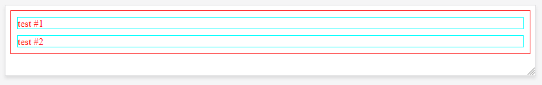
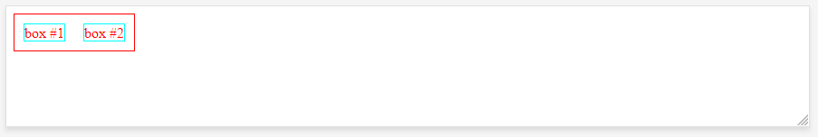
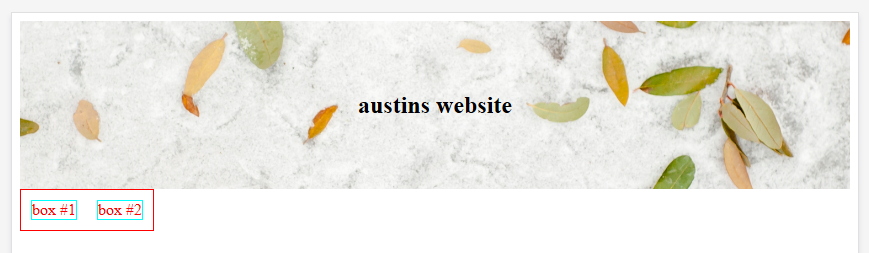
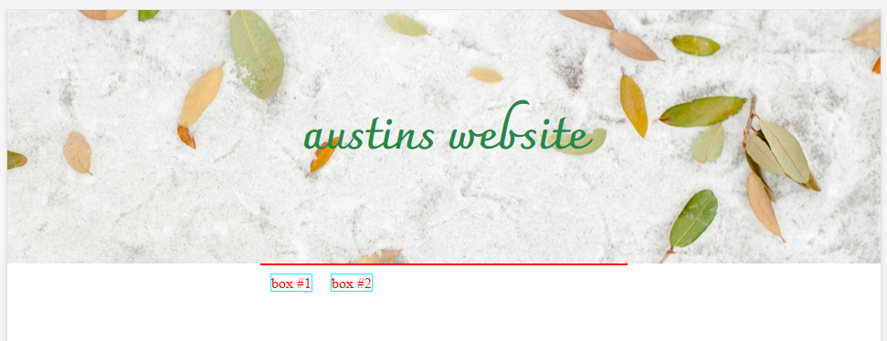
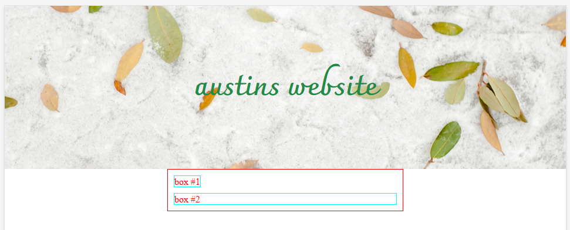
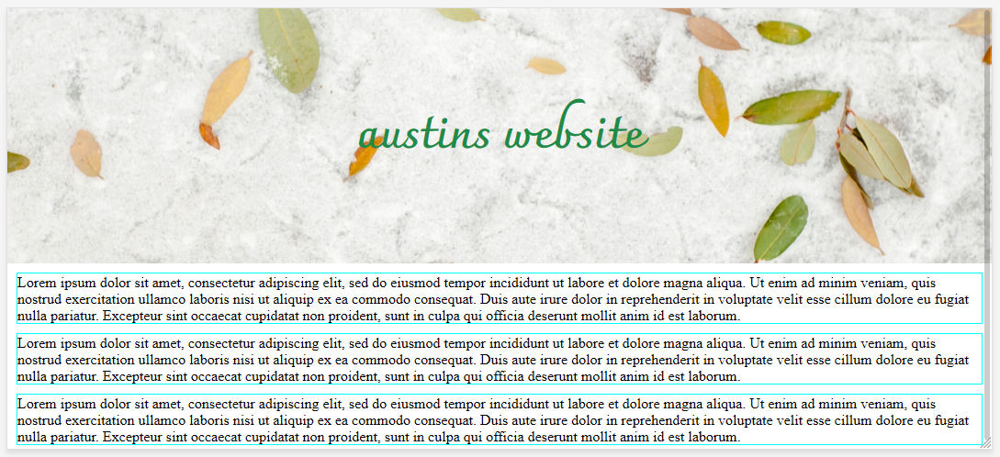

# Part 2, Basic HTML/CSS/JS (Windows Instructions)

* 1 Delete the `<p>` tag and write this instead
  
`index.html`
Go to this file in your explorer
```
<main>
    <div class="div-1">box #1</div>
</main>
```
`sass/style.scss`
Go to this file in your explorer
```
main{
    color:red;
    border:1px solid red;
}
```
Your website should look like below


* 2 Next we are going to add another `<div>` inside the `<main>` wrapper like so.

```
<main>
    <div class="div-1">box #1</div>
    <div class="div-2">box #2</div>
</main>
```
* 3 Next add the following css, and your new styles should look like below

```
main{
    color:red;
    border:1px solid red;
}
.div-1, .div-2{
    border:1px solid aqua;
    margin: 10px;
}
```
Now your page should look something like this



* 4 Now you are going to put these divs on the same line and then center the containing red `<main>` container, using some css declarations. First lets put those `<div>`'s on the same line
```
main{
    color:red;
    border:1px solid red;
    position:relative;
    float: left;
}
.div-1, .div-2{
    border:1px solid aqua;
    margin: 10px;
    float: left;
}
```
So here we added `float:left`'s and a `position:relative` this is the css box model, your page should look like below now



* 5 Now we are going to add a `section` above these that fills the whole screen, has a background image and has text floating on top. Append your code to look like the below.

```
<body>
    <section>
        <h1>yourn-name's website</h1>
    </section>
    <main>
    ...   
</body>
```

* 6 you wont see much but the text added above the red box, let's style the section so it has a `background-image` and the text is centered. Write the following code in your `styles.scss` file, also create a `images` folder in your root directory, and download a image to put in it, name it bg.png or bg.jpg depending on what type of file you downloaded.

```
section{
    text-align:center;
    background-image:url("../images/bg.jpg");
    margin:0;
    padding:50px;
    background-size:cover;
    background-position: center center;
}
main{...
```

* 7 Now you should see something like below



* 8 Next we are going to add a custom google font to your header text `your-name-website` you can search google font's for any font you like https://fonts.google.com/ let's search for `Charmonman` Click the plus button, open the `family selected` tab in the bottom right, some code will popup, first click on the `@import` red tab and copy and paste the code inside the `<style>` tag and paste it into the top of your `styles.scss` file like so

```
@import url('https://fonts.googleapis.com/css?family=Charmonman:700');
section{...
```

* 9 Now to set the header text on top of the background image to this font, add the following code inside your `section` class. You can change the `color` & `font-size` to any value you like. The color is called a hex so you can search for hex color picker to get values you like, or fit with the image you picked.

```
section{
    ...
    h1{
       font-family: 'Charmonman', cursive;
       font-weight:700;
       font-size:50px;
       color:#208a47;
    }
}
```

* 10 Next we will center the red `<main>` container element and give it a `max-width` so it is responsive when you resize the browser. Ammend your `main` section css to look like below.
  
```
main{
    color:red;
    border: 1px solid red;
    position: relative;
    max-width:400px;
    margin:0 auto;
}
```

The site should now look like this below


* 11 Next we are going to fix the problem of the `<main>` container having no height, to do this we need to use a `clear` and a `float` We are going to break up Add the two `div`'s into seperate css declrations add the following code to your `styles.scss` file.

```
.div-1, .div-2{
    ...
}
.div-2{
    clear: left;
    float: none;
}
```

The page should now look like below


* 12 Now we are going to put the 2nd box back where it is and add a third box that will be centered inside the `<main>` container and underneath the two boxes, we will use a combination of the `float`, `clear` and `margin` properties. Add the following css and html respectively. Where I have written `//...` you are to delete those styles.

`styles.scss`
```
.div-1, .div-2{
    ...
}
// .div-2{
//     clear: left;
//     float: none;
// }
.div-3{
    border:1px solid aqua;
    clear: both;
    width: 100px;
    margin:0 auto;
    text-align: center;
}
```
`index.html`
```
<main>
    ...
    <div class="div-3">box #3</div>
</main> 
```

* 13 Now lets do some fancier styling with `flex-box` this is a much better tool than using `floats`, `margin's` so on. We are going to have to do some refactoring, anytime I write `//word` you delete that line of code, ok do the following code in your `styles.scss` file

```
main{
    ...
}
.div-1, .div-2, .div-3{
    border:1px solid aqua;
    margin:10px;
    //float: left;
}
//.div-3{
    //border:1px solid aqua;
    //clear: both;
    //width: 100px;
    //margin:0 auto;
    //text-align: center;
//}
```

* 14 replace your `box` div's with the following
```
<div class="div-1">
    Lorem ipsum dolor sit amet, consectetur adipiscing elit, sed do eiusmod tempor incididunt ut labore et dolore magna aliqua. Ut enim ad minim veniam, quis nostrud exercitation ullamco laboris nisi ut aliquip ex ea commodo consequat. Duis aute irure dolor in reprehenderit in voluptate velit esse cillum dolore eu fugiat nulla pariatur. Excepteur sint occaecat cupidatat non proident, sunt in culpa qui officia deserunt mollit anim id est laborum.
</div>
<div class="div-2">
    Lorem ipsum dolor sit amet, consectetur adipiscing elit, sed do eiusmod tempor incididunt ut labore et dolore magna aliqua. Ut enim ad minim veniam, quis nostrud exercitation ullamco laboris nisi ut aliquip ex ea commodo consequat. Duis aute irure dolor in reprehenderit in voluptate velit esse cillum dolore eu fugiat nulla pariatur. Excepteur sint occaecat cupidatat non proident, sunt in culpa qui officia deserunt mollit anim id est laborum.
</div>
<div class="div-3">
    Lorem ipsum dolor sit amet, consectetur adipiscing elit, sed do eiusmod tempor incididunt ut labore et dolore magna aliqua. Ut enim ad minim veniam, quis nostrud exercitation ullamco laboris nisi ut aliquip ex ea commodo consequat. Duis aute irure dolor in reprehenderit in voluptate velit esse cillum dolore eu fugiat nulla pariatur. Excepteur sint occaecat cupidatat non proident, sunt in culpa qui officia deserunt mollit anim id est laborum.
</div>
```
Your site should now look like below


* 15 Next we are going to introduce `flex-box` and some other styles, add anything that says `//new` and deleted anything that has `//` in front of it.

```
@import url('https://fonts.googleapis.com/css?family=Charmonman:700');
body{
    margin:0;
    font-family:Arial, Helvetica, sans-serif; //new
    line-height: 175%;//new
}
section{
    ...
}
main{
    color:#4a4a4a; //new
    //border: 1px solid red;
    position: relative;
    max-width:1200px; //new
    margin:0 auto;
    display: flex;//new
    margin-top:50px; //new
}
.div-1, .div-2, .div-3{
    //border:1px solid aqua;
    margin:10px;
}
```

* 16 Now we are going to introduce respnisve style with media queries. A media querie can change your css when the browser window size changes. Here we go

```
main{
    ...
    flex-direction: column; //new
    @media only screen and (min-width: 768px)  { //new
        flex-direction: row; //new
    }//new
}
```

Your site should now look like below


* 17 Now we are going to use some javascript to rearrange the columns on the page, we are going to used a library called jquery to do so. Ok Change your html so we can identify each div, add in the new parts, except the comment itself.

`index.html` lower down
```
<div class="div-1">
    #1<!--new-->
    ...
</div>
<div class="div-2">
    #2<!--new-->
    ...
</div>
<div class="div-3">
    #3<!--new-->
    ...
</div>
```
`index.html` at the top
```
<head>
    ...
    <!--new-->
    <script
        src="https://code.jquery.com/jquery-3.3.1.slim.min.js"
        integrity="sha256-3edrmyuQ0w65f8gfBsqowzjJe2iM6n0nKciPUp8y+7E="
        crossorigin="anonymous">
    </script>
    <script src="js/main.js"></script>
</head>
```

* 18 create a file called `main.js` in a folder called `js` in the root directory. Add the following code in, save and open your broweser inspector and look in the console tab.

```
$(document).ready(function() {
  console.log("ready!");
});
```

* 19 Add a button to your html like below, add the following styles to your css as below and add the following code to your main.js file, and click the button and observe what happens

`index.html`
```
<main>
  ...
</main>
<!--new-->
<div class="button-wrapper">
  <button>reverse order</button>
</div>
```
`styles.scss`
```
main{
    ...
    &.reverse{
        flex-direction: column-reverse;
    }
    @media only screen and (min-width: 768px)  {
        flex-direction: row;
        &.reverse{
            flex-direction: row-reverse;
        }
    }
}
```

